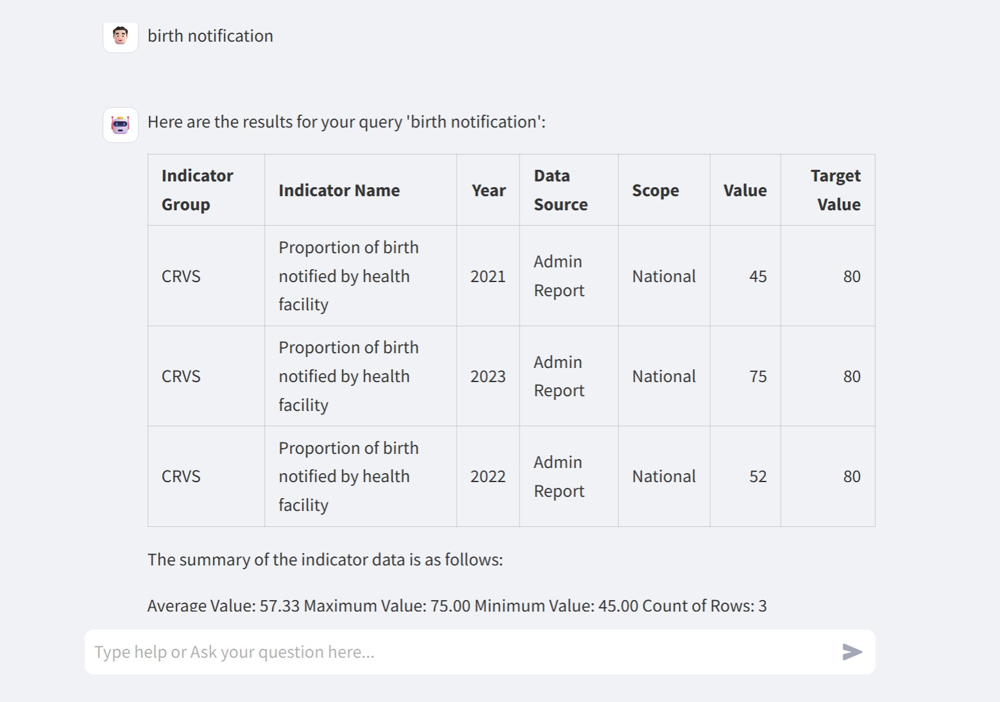
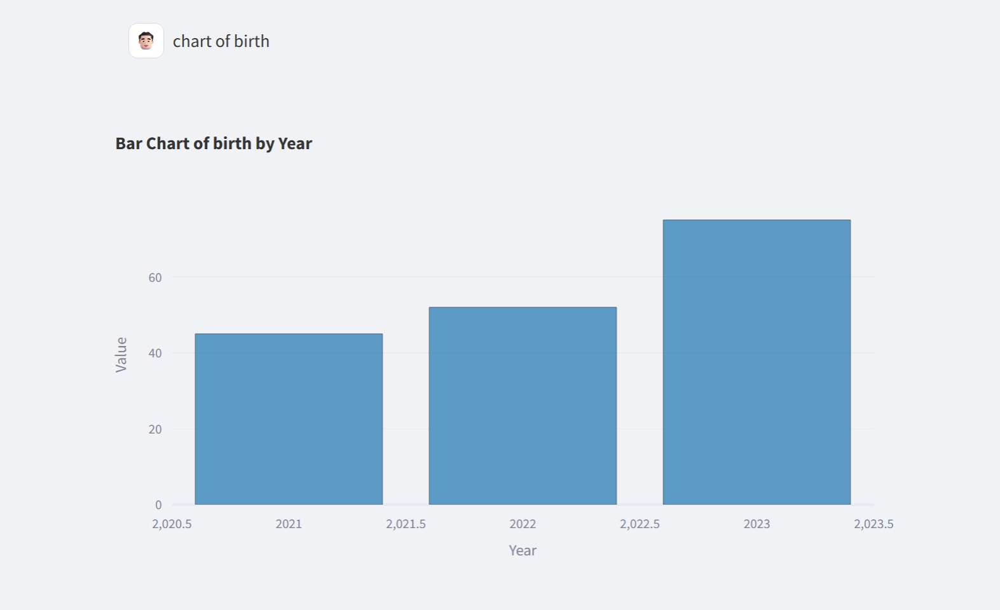
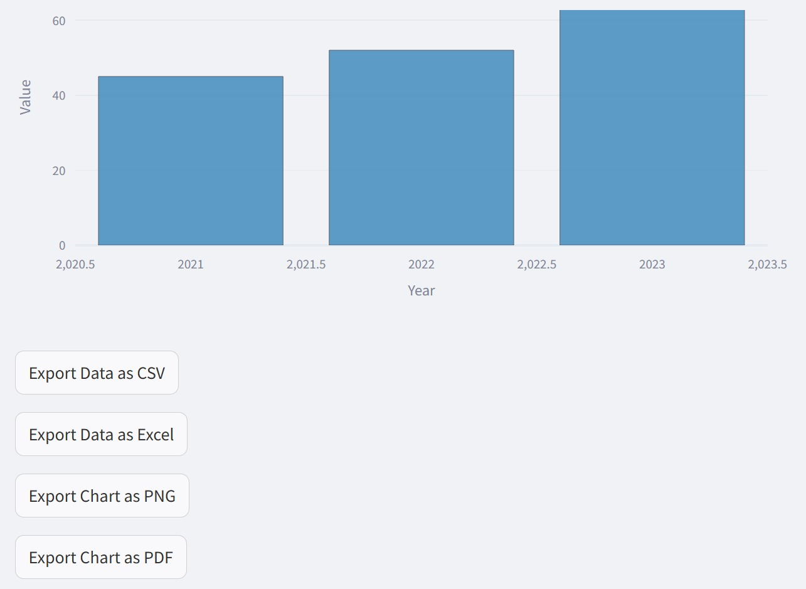

# 10. AI Data Assistant

## 10.1 Overview of the HISPMD AI Data Assistant

The **HISPMD AI Data Assistant** enables users to interact with Ethiopia’s health indicator data using natural language queries. Designed as a **rule-based chatbot**, this assistant simplifies data exploration without requiring technical skills.

Though it leverages a chatbot-style interface, **no AI or machine learning is used**. The system is built using **Streamlit** for the UI and **SQLAlchemy** for structured database queries, ensuring a focused and reliable tool for HISPMD indicator data.

### Key Benefits

* **User-Friendly**: Ask questions in plain language to get quick insights.
* **Accessible**: No coding required — works entirely within a web browser.
* **Custom Visualizations**: Request charts like bar, line, and pie charts using simple commands.
* **Ethiopia-Specific**: Works exclusively on HISPMD data and follows national HIS indicator standards.

 

*Figure 10.1: Example of AI Data Assistant responding to user queries*

---

## 10.2 How to Use the AI Chatbot

### 🧭 Steps to Start

1. Open the AI Data Assistant module from the HISPMD dashboard.
2. Type your question in the input field.
3. Get instant responses based on the current HIS indicator data.

### ✅ Example Questions You Can Ask

| **Type**             | **Example Queries**                                                                                     |
| -------------------- | ------------------------------------------------------------------------------------------------------- |
| Greetings & Basic    | “Hello”, “Hi”, “List all data”                                                                          |
| Summary Statistics   | “How many indicators are there?”, “What is the average value of \[Indicator Name]?”                     |
| Aggregations         | “What is the sum of \[Indicator Name]?”, “Show unique indicators”                                       |
| Insight by Indicator | “Give me a summary of \[Indicator Name]”, “What is the value of \[Indicator Name] in the year \[Year]?” |
| Extremes             | “Show the lowest value for \[Indicator Name]”, “Show the highest value for \[Indicator Name]”           |

---

## 10.3 How to Generate Charts

The chatbot supports visualizations that summarize indicator trends using natural queries.

### 📊 Supported Chart Types

| **Chart Type**       | **Example Query**                                                        |
| -------------------- | ------------------------------------------------------------------------ |
| Bar Chart            | “Show a bar chart of reporting timeliness by year”                       |
| Line Chart           | “Show a line chart of birth notification by year”                        |
| Area Chart           | “Show an area chart of reporting completeness by year”                   |
| Pie Chart            | “Show a pie chart of woredas by data source detail”                      |
| Horizontal Bar Chart | “Show a horizontal bar chart of reporting completeness by Facility Type” |
| Combo Chart          | “Show a combo chart of reporting timeliness by region for year 2024”     |

 

*Figure 10.2: Example of a generated chart based on natural language input*

 

*Figure 10.3: Example of a generated chart for exporting in various formats*

---

## 10.4 About the AI Data Assistant

The **HISPMD AI Data Assistant** is a simple and efficient tool developed to enhance user interaction with Ethiopia’s Health Information System indicators.

### 🔍 Key Notes

* The assistant uses **rule-based logic**, not artificial intelligence or machine learning.
* Data interaction is made possible via **SQLAlchemy**.
* Built with **Streamlit**, ensuring an intuitive user experience.

---

## 10.5 Additional Info

### ℹ Relevant Information

* The assistant is tailored **only for HISPMD data**.
* Developed and maintained by **Information Systems & Digital Health Unit**.
* For data-related questions, please contact the official support team.

---

## 10.6 Best Practices for Using the AI Assistant

| **Best Practice**                      | **Why It Matters**                                               |
| -------------------------------------- | ---------------------------------------------------------------- |
| Use clear indicator names              | Ensures accurate data is retrieved.                              |
| Be specific in year or region queries  | Helps generate more relevant charts and statistics.              |
| Validate generated charts for accuracy | Visuals rely on HISPMD database — always double-check summaries. |
| Keep questions focused                 | One indicator per question yields best results.                  |

---

## 10.7 Summary of AI Data Assistant Features

* **Natural Language Interface**: Ask questions like “What’s the average value of reporting completeness?”
* **Chart Support**: Bar, Line, Pie, Area, Combo charts with simple text prompts.
* **Data-Specific**: Built exclusively for HISPMD’s indicator dataset.
* **Rule-Based Engine**: No machine learning used — responses are deterministic and based on data rules.
* **Support Access**: Developer and consultancy support available for questions and enhancements.

📌 **Next Section**: Learn how to manage your data securely in the **User Management & Access Control** module. 🔐

---
---

### 🛠 Developer Info

* **Powered by**: MERQ Consultancy
* **Developer**: Michael Kifle Teferra
* **Contact**: [+251913391985](+251913391985)
* **LinkedIn**: [Michael K. Teferra](https://www.linkedin.com/in/michael-teferra-50573079/)
* **Web**: [mikeintoshsys.com](http://mikeintoshsys.com)
* **Telegram**: [@mikeintosh](https://t.me/mikeintosh)
* **GitHub**: [MIKEINTOSHSYSTEMS](https://github.com/MIKEINTOSHSYSTEMS)
* **Support Email**: [support@merqconsultancy.org](mailto:support@merqconsultancy.org)
---
---
