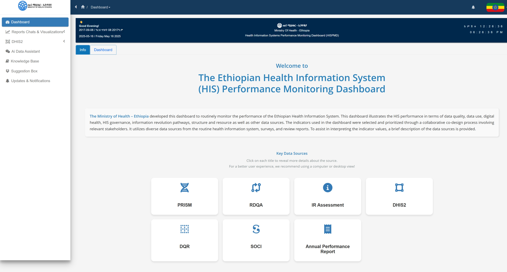

# 3. Dashboard Navigation

The Health Information Systems Performance Monitoring Dashboard (HISPMD) is designed for ease of use, with an intuitive interface that allows users to access health performance data, visualize trends, and generate reports efficiently. This section provides a comprehensive guide to navigating the dashboard, including understanding the main menu, using filters, and exploring key functionalities.

Figure 3.1: Key Indicators Data Source

 

Figure 3.2: Landing Dashboard Page

 

## 3.1 Main Menu and Sections

After logging in, you will be directed to the dashboard home page, where you can access various features through the main menu. The menu is typically located on the left sidebar (for desktop users) or in a hamburger menu (for mobile users).

Figure 3.3: HISPMD Basic Menu Items and Sections

 

### Overview of Main Sections

| Section         | Description |
|----------------|------------|
| **Home**       | Provides a quick overview of health indicators data source with visual summaries. |
| **Indicators** | Displays detailed performance metrics categorized by health indicators. Users can apply filters to view data by region, facility type, and time period. |
| **Reports**    | Allows users to generate, customize, and export reports based on selected indicators and filters. |
| **User Management (Admin Only)** | Enables administrators to add, edit, and manage user accounts and permissions. |
| **User Settings** | Provides options for dashboard customization, including themes, API connections, and default filters. |
| **Help & Support** | Access to user guides, FAQs, and support contact details. |

---

## 3.2 Exploring the Home Dashboard

The Home Dashboard serves as the landing page after login and provides:

- A summary of key health indicators.
- Quick insights through interactive charts and graphs.
- Alerts or updates on performance trends.

Users can click on any **Indicator Group (Tabs)** to explore more details and apply filters for deeper analysis.

Figure 3.4: Indicator Group Tabs

 

---

## 3.3 Search and Filter Options

To efficiently navigate the dashboard and retrieve relevant data, users can take advantage of the **search and filtering** features.

### Steps to Search and Filter:
1. Select an **Indicator Group**.
2. Select **Indicators** under that specific Indicator Group.
3. Select the **Data Source** for that indicator.
4. Select **Period Type** (Monthly, Quarterly, Yearly) and hit **Search**.
5. If data is available based on the selected filters, it will be displayed.

💡 **Standard Search and Filter Usage**: This approach applies to all data-driven interfaces.

Figure 3.5: Standard(Basic) Searching & Filtering Options

 

---

### Example: Using the Sidebar Search Option

#### **Using the Search Bar**
- Located at the **top of the dashboard**, the search bar allows users to quickly find indicators or reports.
- Start typing On the Indicator Group and Select an indicator name or attribute, and relevant results will appear in real-time.
- Click on **Search** to view detailed data.

Figure 3.6: Example of Indicator data report generation

 

#### **Applying Filters**
Filters refine data based on various parameters. The filter panel is found at the **top or side** of the page.

Figure 3.7: Standard Further Filter Options after Search Results

 

| Filter          | Description |
|----------------|------------|
| **Region**     | Select a specific region or compare multiple regions. |
| **Facility Type** | Filter by hospitals, health centers, clinics, or community health posts. |
| **Time Period** | Choose a specific year, quarter, or month for trend analysis. |
| **Indicator Group** | Parent group for categorizing indicators. |
| **Data Source** | Select reporting source (PRISM, RDQA, IR Assessment, DHIS2, DQR). |
| **Scope** | Determines whether data is **National** or **Regional**. |

🔹 **Tip:** Multiple filters can be applied simultaneously for a **granular** data view.

---

## 3.4 Viewing and Interacting with Data

Once an indicator or dataset is selected, users can interact with various data representations.

We will be viewing it all on the **Data Visualizations** Section

### **Understanding Charts and Graphs**
HISPMD provides multiple data visualization types for enhanced interpretation:

📊 **Bar Charts** – Compare different data categories.

📈 **Line Graphs** – Analyze trends over time.

🟢 **Pie Charts** – Show proportions within a dataset.

🔍 **Tables** – Display raw data for detailed analysis.

### **Interacting with Charts**
- Hover over **data points** to see exact values.
- Click on **legend items** to show/hide specific data series.
- Use the **zoom function** to analyze specific timeframes.

📌 **Note:** Further details on **Data Visualization** will be covered in a separate section.

---

## 3.5 Navigating Between Views

Users can easily switch between **summary views** and **detailed views** by:

- Clicking on an **Indicator Group Tabs** in the Home Dashboard. (As described on Section 3.2 and on Figure 3.4)
- Selecting a **specific indicator group** from the **Indicators group tabs**.
- Applying **Indicator/Dataset** from the available filters by ticking on the checkboxs
- Applying **Organisation Units** to select Specific Organisation Unit (Region).
- Applying **Periods/Relative Periods** to select Specific Period(s).
- Clicking the **Back button** on the filters to return to the previous view.

🔹 **Tip:** Some dashboards support **drill-downs**—clicking on a **region** or **facility type** will display more detailed breakdowns.

Figure 3.8: Dashboard Home Filters

 

---

## 3.6 Exporting Data from the Dashboard

Users can extract data for **offline analysis** or **reporting**.
By clicking on the three (3) dots ...

### **Export Options**
- **Excel (XLSX)** – Best for further analysis.
- **CSV** – Useful for Data Exploration and Analysis.
- **JSON** – Useful for system integration.
- **PNG** – Useful for embeding in your report as a picture.
- **PDF Print** – Ideal for sharing formatted reports and printing.

Figure 3.8: Data Export from home dashboard and charts

 

### **How to Export Data from HIS Indicators Data Chart**
1. Choose the **data scope** (filtered data or full dataset).
2. **Right-click** on the chart you want to export.
3. Select the **file format**.
4. Click **Download**.

Figure 3.9: Data Export from home dashboard and charts

 

### **How to Export Data from Indicators Data Table or Report**
1. Choose the **data scope** (filtered data or full dataset).
2. Click on the **Gear ⚙️ icon** in the **top Search/Navigation bar**.
3. Select the desired **file format**—download starts automatically.

---

Figure 3.10: Data Export and Advanced Search

 

Figure 3.11: Data results print to PDF File or Paper

 

## 3.7 Getting Help & Support

If you encounter issues, you can access support through:

- **Help & Support Menu** – Includes FAQs, user guides, and troubleshooting.
- **Live Chat** – Available for instant assistance (**TBD**).
- **Support Email** – Contact [support@merqconsultancy.org](mailto:support@merqconsultancy.org).
- **User Training** – Admins can schedule training sessions.

---

### **Summary of Key Navigation Features**

| Feature                 | How to Access |
|-------------------------|--------------|
| **View Key Indicators** | Home Dashboard or Indicators section. |
| **Apply Filters**       | Use the filter panel at the top of the page. |
| **Search for Data**     | Use the search bar at the top. |
| **Interact with Charts** | Click, hover, and zoom in on graphs. |
| **Export Reports**      | Click **Export**, choose format, and download. |
| **Access Help**         | Click **Help & Support** in the menu. |

---

Now that you understand **how to navigate the dashboard**, you can move on to **Data Visualization**, where you'll learn how to interpret and analyze health system performance data effectively in various data visualization types. 🚀
