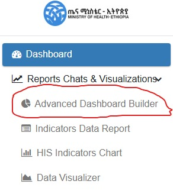

# 4. Data Visualization

The **Health Information Systems Performance Monitoring Dashboard (HISPMD)** offers two powerful approaches to data visualization: the **Advanced Dashboard Builder** for creating custom interactive dashboards, and **pre-built visualizations** for quick analysis. This section provides comprehensive guides for both approaches.

---

## 4.1 Advanced Dashboard Builder

The **Advanced Dashboard Builder** is an interactive tool that enables users to design, customize, and save personalized dashboards with multiple visualization components. This feature transforms complex health data into actionable insights through a flexible, user-friendly interface.

Figure 4.0: Advanced Dashboard Builder

### To access the advanced dashboard builder
Go to The left side navigation menu under **-> Reports Chats & Visualizations -> Advanced Dashboard Builder** as Displayed on the image below.

Figure 4.1: Accessing Advanced Dashboard Builder

### 4.1.1 Key Features and Benefits

- **Complete customization** - Build dashboards tailored to specific monitoring needs
- **Multi-chart layouts** - Combine various visualization types in one view
- **Interactive elements** - Drill down, filter, and explore data dynamically
- **Save/load functionality** - Preserve dashboard configurations for future use
- **Responsive design** - Works on desktop and mobile devices
- **Export capabilities** - Share insights with stakeholders

### 4.1.2 Interface Overview

Figure 4.2: Dashboard Builder Interface Components

The interface consists of three main areas:

1. **Navigation Sidebar (Left)**
   - Chart creation controls
   - Comprehensive filtering options
   - Dashboard management tools

2. **Dashboard Canvas (Center)**
   - Interactive workspace for charts
   - Drag-and-drop functionality
   - Real-time preview of visualizations

3. **Chart Configuration Panel**
   - Appears when adding/editing charts
   - Contains all customization options
   - Live preview of changes

### 4.1.3 Creating a New Dashboard

#### Step 1: Add Your First Chart

1. Click the **"New Chart"** button in the sidebar
2. The Add Chart modal will appear with configuration options

#### Step 2: Configure Chart Properties

In the Add Chart modal:

**Basic Settings:**

- **Chart Title:** Enter a descriptive name
- **Chart Type:** Select from 15+ visualization types
- **X-Axis:** Choose primary dimension (Year, Region, Indicator etc.)
- **Y-Axis:** Select measurement value (Value, Target Value, etc.)

**Advanced Filters:**

- Apply filters to focus on specific data subsets:
  - Indicator Groups
  - Individual Indicators
  - Data Sources
  - Geographic Regions
  - Time Periods
  - Facility Types

**Display Options:**

- Toggle legend visibility
- Enable/disable data labels
- Configure tooltip details
- Set custom sizes of the chart box

Figure 4.3: Creating New Charts to the Dashboard Builder

#### Step 3: Position and Resize Charts

- **Drag** charts to position them on the canvas
- Use the **resize handles** to adjust dimensions
- Charts automatically snap to grid for alignment

### 4.1.4 Managing Dashboards

#### Saving Dashboards

1. Click **"Save Dashboard"** in the sidebar
2. Enter a descriptive name (e.g., "Yearly Performance Overview")
3. Click Save - configuration is stored for future sessions

#### Loading Dashboards

1. Click **"Load Dashboard"** in the sidebar
2. Select from your saved dashboards
3. The system will load all charts and filters from the previously saved parameters and settings.

Figure 4.4: Loading Previously Saved Dashboard

#### Dashboard Actions

- **Reset:** Clear all charts and start fresh
- **Export:** Save dashboard charts as Image, XLSX or PDF
- **Print:** Generate printer-friendly version
- **View Raw Data:** Display Chart Data as a data table

### 4.1.5 Chart Types Available

The Dashboard Builder supports these visualization types:

| Chart Type | Best For | Example Use Case |
|------------|----------|------------------|
| Column | Comparisons | Facility performance by region |
| Line | Trends | Reporting rates over time |
| Pie | Proportions | Data source distribution |
| Area | Cumulative data | Service coverage growth |
| Stacked Column | Part-to-whole | Indicator breakdowns |
| Gauge | Target progress | KPI achievement |
| Geo Map | Spatial analysis | Regional performance |
| Radar | Multi-dimensional | Facility capability assessment |

### 4.1.6 Advanced Features

**Interactive Filtering:**

- Click on chart elements to filter other visualizations
- Use CTRL+Click to select multiple items
- Right-click to clear selections

**Data Export:**

- Export chart data to Excel/CSV
- Save images (PNG/JPEG) for reports
- Generate PDF summaries

**Mobile Optimization:**

- Responsive layout adapts to screen size
- Touch-friendly controls
- Simplified mobile menu

---

## 4.2 Overview of Pre-built Data Visualizations

For users who prefer ready-made visualizations, HISPMD provides pre-built charts and graphs that transform raw health data into actionable insights. These help users:

- 📊 Identify trends and patterns over time.
- 📍 Compare performance across regions, facility types, and demographic groups.
- ⚠️ Detect anomalies or unexpected variations in health indicators.
- 📑 Generate reports for decision-making and policy recommendations.

### 4.2.1 Accessing the Data Visualizer

Figure 4.5: Accessing Data Visualizer Menu Item

1. Navigate to the **left sidebar** under the `Reports Charts & Visualization` menu
2. Click on `Data Visualizer`
3. The visualization interface will load with default charts

Figure 4.6: Advanced Live Data Visualizer Options

---

## 4.3 Types of Visualizations

HISPMD provides several types of data visualizations, each serving a specific analytical purpose.

Figure 4.7: Data Visualizer Chart Types

### 4.3.1 Line Charts (Trend Analysis)

📈 **Best For:** Analyzing changes in indicators over time
🔍 **Example:** Tracking reporting rates over multiple years

#### How to Use

- Hover over data points to see exact values
- Click legend items to show/hide specific series
- Drag to zoom into specific time periods
- Double-click to reset zoom

Figure 4.8: Example of Trend Analysis Using Line Chart

### 4.3.2 Bar/Column Charts (Comparative Analysis)

📊 **Best For:** Comparing categories within an indicator
🔍 **Example:** Facility performance by type

#### How to Use

- Hover over bars for detailed values
- Click to drill down into sub-categories
- Use stacked view for part-to-whole analysis

### 4.3.3 Pie Charts (Proportional Analysis)

🟢 **Best For:** Showing distribution percentages
🔍 **Example:** Data source composition

#### How to Use

- Hover for percentage values
- Click slices to isolate categories
- Combine with filters for dynamic views

Figure 4.9: Proportional Analysis Using Pie Chart

### 4.3.4 Heat Maps (Geospatial Analysis)

🌍 **Best For:** Geographic performance patterns
🔍 **Example:** Regional coverage rates

#### How to Use

- Click regions to view detailed data
- Use legend to interpret color scales
- Zoom for higher granularity

### 4.3.5 Data Tables (Detailed Records)

📑 **Best For:** Precise value comparison
🔍 **Example:** Facility-level performance metrics

#### How to Use

- Sort columns by clicking headers
- Use search to filter records
- Export for further analysis

---

## 4.4 Interacting with Visualizations

### 4.4.1 Common Interactive Features

| Feature | Description | How to Use |
|---------|-------------|------------|
| Tooltips | Detailed data values | Hover over elements |
| Legend Toggle | Show/hide data series | Click legend items |
| Zoom | Focus on specific ranges | Drag to select area |
| Drill-down | View sub-categories | Click chart elements |
| Cross-filter | Link multiple charts | Select items while holding CTRL |

### 4.4.2 Advanced Navigation

**Keyboard Shortcuts:**

- **Arrow keys:** Pan zoomed charts
- **ESC:** Reset all filters
- **CTRL+Z:** Undo last action

**Touch Gestures (Mobile):**

- Pinch to zoom
- Swipe to pan
- Tap to select

---

## 4.5 Customizing Visualizations

### 4.5.1 Dashboard Builder Customization

As described in section 4.1, the Dashboard Builder offers complete control over:

- Chart types and combinations
- Color schemes and styling
- Layout and organization
- Filter presets

### 4.5.2 Pre-built Visualization Customization

| Option | Description | Access Method |
|--------|-------------|---------------|
| Time Range | Adjust date period | Timeline selector |
| Indicators | Select metrics | Dropdown filter |
| Regions | Geographic focus | Map or dropdown |
| Chart Type | Switch visualization | Chart type selector |
| Color Theme | Change palette | Settings cog |

---

## 4.6 Exporting and Sharing

### 4.6.1 Export Formats

| Format | Best For | How to Export |
|--------|----------|---------------|
| PNG/JPEG | Reports, presentations | Right-click → "Save Image" |
| PDF | Printable documents | Export button → PDF |
| Excel | Further analysis | Export button → XLSX |
| CSV | Data processing | Export button → CSV |

### 4.6.2 Sharing Options

1. **Direct Link Sharing:**
   - Generate shareable URLs
   - Set expiration dates
   - Control access levels

2. **Embed Codes:**
   - HTML snippets for websites
   - Responsive iframes
   - Auto-updating data

---

## 4.7 Using Visualizations for Decision-Making

### 4.7.1 Practical Applications

**For Program Managers:**

- Identify low-performing facilities
- Track intervention effectiveness
- Allocate resources strategically

**For Health Officials:**

- Monitor system-wide performance
- Detect emerging trends
- Benchmark regional performance

**For Partners:**

- Verify program impact
- Demonstrate accountability
- Support funding requests

### 4.7.2 Best Practices

1. **Start with Key Questions:**
   - What problem needs solving?
   - What data answers this?
   - Which visualization shows it best?

2. **Use Appropriate Chart Types:**
   - Time trends → Line charts
   - Comparisons → Bar charts
   - Distributions → Pie charts

3. **Apply Smart Filtering:**
   - Focus on relevant time periods
   - Compare similar facilities
   - Isolate priority indicators

---

## 4.8 Summary of Key Features

| Feature | Dashboard Builder | Pre-built Visualizations |
|---------|-------------------|--------------------------|
| Customization | Full control | Limited options |
| Chart Combinations | Multiple per dashboard | Single views |
| Saving | Save full configurations | Save individual charts |
| Learning Curve | Moderate | Easy |
| Best For | Ongoing monitoring | Quick analysis |

🚀 **Next Section:** Learn how to generate detailed reports in **Section 5: Report Generation & Exporting**

---

> 📌 **Pro Tip:** Combine both approaches - use pre-built visualizations for quick insights, then build custom dashboards for ongoing monitoring of key metrics.
