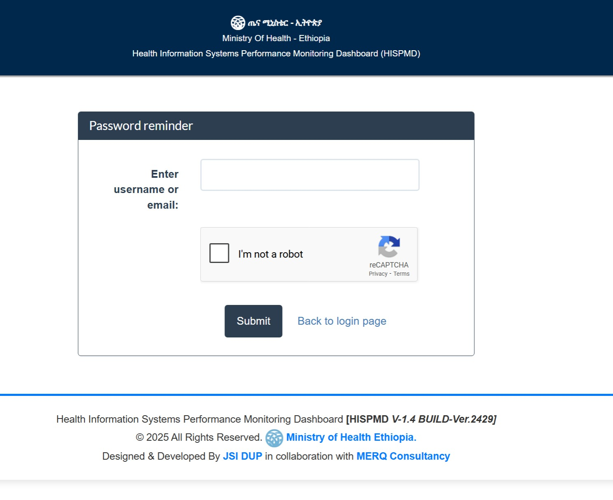

site_name: HISPMD Documentation
site_description: Documentation for the Health Information Systems Performance Monitoring Dashboard (HISPMD)
theme:
  name: material
  features:
    - navigation.tabs
    - navigation.top
    - toc.integrate
    - search.suggest
    - search.highlight

---

# Getting Started

This section will guide you through the initial steps of accessing and using HISPMD, including logging in and understanding user roles and permissions.

## Logging into the Dashboard

Follow these steps to access HISPMD:

1. **Open Your Web Browser**
   Use a supported browser such as Google Chrome, Mozilla Firefox, Microsoft Edge, or Apple Safari.

2. **Go to the HISPMD Login Page**

   Enter the URL: [https://hispmd.moh.gov.et/](https://hispmd.moh.gov.et/)

   #### OR

   Enter the URL: [https://hispmd.merqconsultancy.org/](https://hispmd.merqconsultancy.org/)

3. **Enter Your Credentials**
   - **Username**: The username you entered when you create an account.
   - **Password**: The password you have set during registration.

4. **Click on "Login"**
   If your credentials are correct, you will be redirected to the dashboard home page.

   

Figure 2.1: Login Page

 

### Don’t Have an Account?
To access the dashboard, you must create an account:
- Click on the **Sign Up** button.
- Fill out all required fields.
- Follow the on-screen instructions.

Figure 2.2: Registration/Sign Up Page

 

### Forgot Password?
If you forget your password:
1. Click on **Forgot Password?** on the login page.
2. Enter your registered email address.
3. Follow the instructions in the password reset email.

Figure 2.3: Forgot Password Page

 

---

## User Roles and Permissions

HISPMD uses a **role-based access control** system to ensure that users can only access the features and data relevant to their responsibilities.

| Role       | Permissions |
|------------|------------|
| **Admin** | Full access, including user management, data configuration, and system settings. |
| **Data Manager** | Can enter, view, and analyze data, generate reports, download/export, and apply filters but cannot modify system settings or manage users. |
| **Default** | Read-only access to dashboards and reports, ability to download/export without the ability to modify data or settings. |
| **M&E** | Can see all the data manager can access but cannot edit them. |

### Changing User Roles
- **Only Admins** can assign or modify user roles.
- If you require additional access, contact your system administrator.

Now that you have logged in and understand your user role, you can start exploring the dashboard's features. Continue to **Dashboard Navigation** for an overview of how to interact with HISPMD. 🚀
