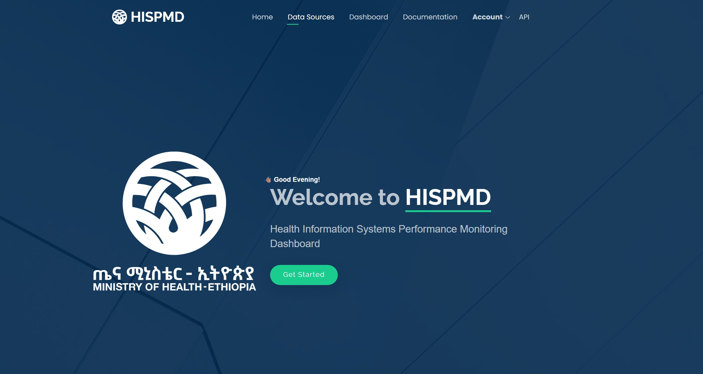

# Introduction

## Overview of HISPMD

   

Figure 1.1: Start Page for the HISPMD

 

The **Health Information Systems Performance Monitoring Dashboard (HISPMD)** is a web-based platform designed to track, analyze, and visualize key health system performance indicators. It serves as a critical tool for health professionals, policymakers, and administrators, enabling them to:

- Monitor health service delivery
- Identify trends
- Make data-driven decisions

HISPMD integrates data from multiple sources, providing a centralized and real-time view of health performance metrics across various regions, facility types, and time periods. Through interactive charts, graphs, and reports, users can:

- Assess progress toward health targets
- Compare performance across locations
- Generate insights for strategic planning

## Key Features

HISPMD offers a range of powerful features, including:

- **Real-Time Data Visualization** – Interactive bar charts, line graphs, and pie charts for quick insights.
- **Performance Tracking** – Monitor key health indicators.
- **Advanced Filtering Options** – Customize views based on region, facility type, year, and other parameters.
- **Comparative Analysis** – Compare performance across different regions or health facilities.
- **Customizable Reports** – Generate and export reports in Excel, CSV, and PDF formats.
- **Role-Based Access Control** – Secure user access with Admin, Data Manager, Entry, Default & M&E roles.

## System Requirements

To ensure optimal performance, users should meet the following requirements:

### Device Compatibility
HISPMD is accessible on:
- Desktops
- Laptops
- Tablets
- Mobile devices

### Web Browser
For the best experience, use one of the following updated browsers:
- Google Chrome
- Mozilla Firefox
- Microsoft Edge
- Apple Safari

Figure 1.2: Browsers Supported

 

### Internet Connection
A stable internet connection is required to access real-time data and generate reports.

### User Account
Access is restricted to authorized users which means a user needs to create a user account for accessing the full functionalities of the system. If you do not have an account you need to create an account by Signing Up or Registering on the system, if you are having issues creating an account or logging in pleasecontact the system administrator for login credentials.

### Demo User Account
#### Use the following Credentials to access the system
Username: demo
 
Password: demo@merq7

---
