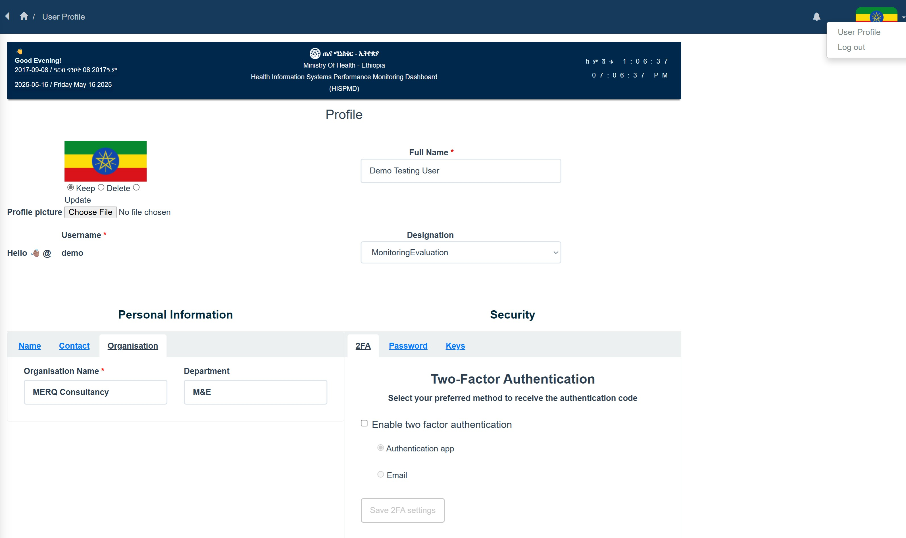
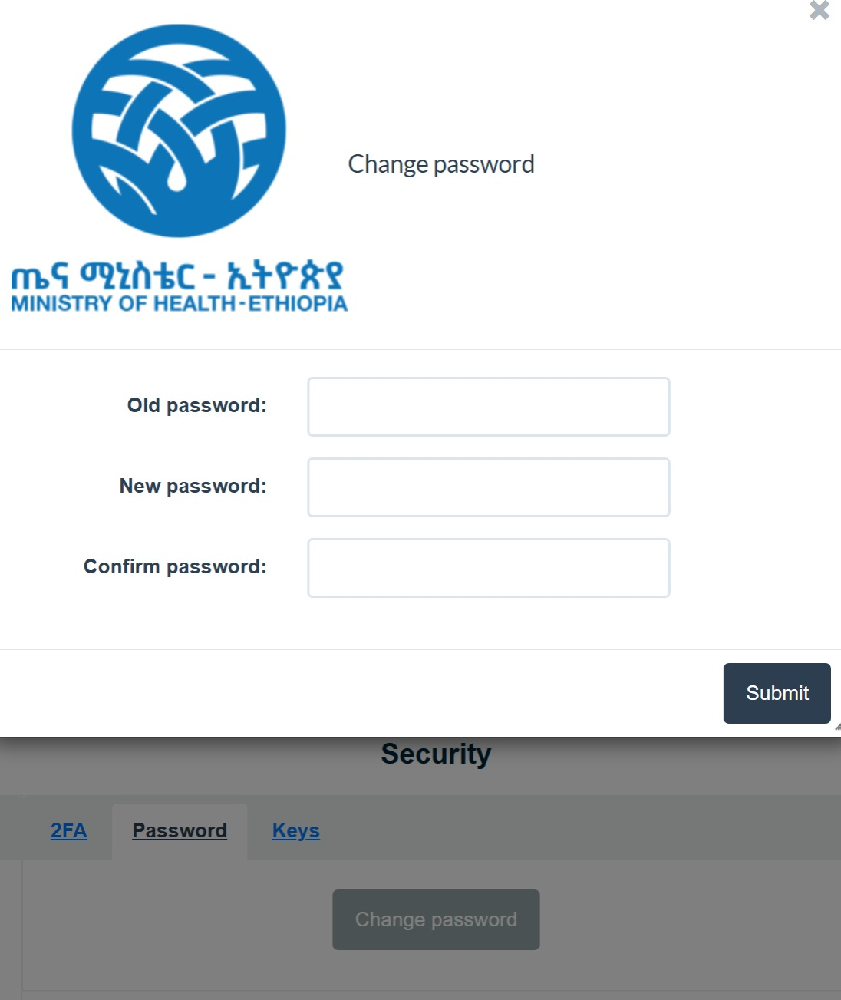
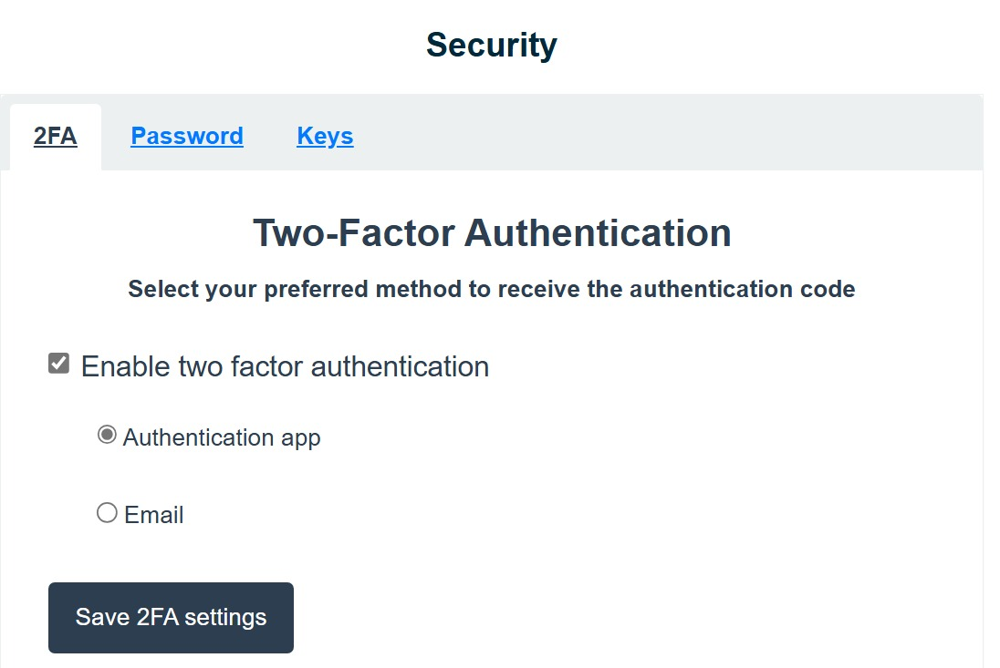
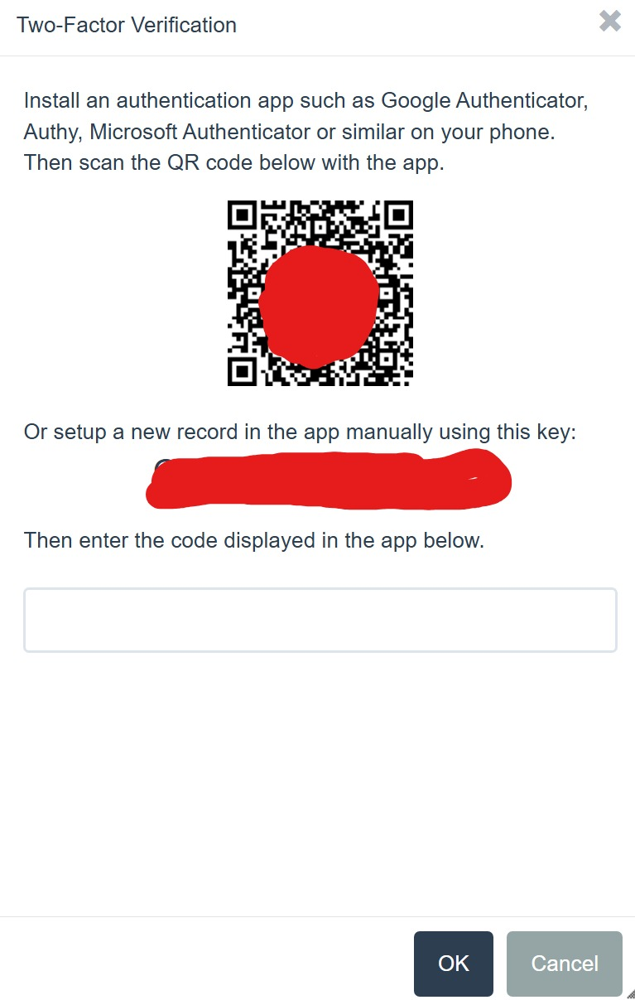

# User Management & Access Control [TBD]

## 7.1 Overview of User Management in HISPMD

The Health Information Systems Performance Monitoring Dashboard (HISPMD) features a robust **User Management and Access Control** system that ensures secure access to health data while allowing role-based permissions for different users. This module is critical for maintaining data security, integrity, and accountability within the system.

### Getting used to User Profile

Your User Profile Consists of the following features and functionalities.

Figure 7.1: Overview of User Profile

 

Figure 7.2: Changing Password

 

Figure 7.3: 2FA (Two Factor Authentication)

 

Figure 7.4: 2FA (Setting Authenticator Application)

 

### Key Features of User Management in HISPMD
- **Role-Based Access Control (RBAC)**: Restrict access to sensitive data based on user roles.
- **User Authentication**: Secure login system using usernames, passwords, and multi-factor authentication (MFA).
- **User Activity Monitoring**: Track user interactions with the system.
- **Permissions Customization**: Assign specific rights to different user groups.
- **Audit Trails & Logging**: Maintain records of user activities for accountability.

## 7.2 User Roles and Permissions

HISPMD operates on a **Role-Based Access Control (RBAC)** model, ensuring that users only have access to data and functionalities relevant to their role.

### 7.2.1 Standard User Roles

| **Role**         | **Description**                                           | **Permissions**                                                                                       |
|------------------|-----------------------------------------------------------|------------------------------------------------------------------------------------------------------|
| **Administrator** | Full control over system settings, users, and reports.    | Create, edit, delete users; manage permissions; configure system settings.                           |
| **Data Manager**  | Manages data entry, processing, and validation.           | Add, edit, delete health data; validate data integrity.                                               |
| **M&E**           | Analyzes data trends and generates reports.               | Access and export datasets; create custom reports; apply filters.                                    |
| **Default (Read-Only)** | Can view dashboards and reports but cannot modify data. | View reports and analytics; no editing or exporting permissions.                                      |
| **Regional Manager** | [TBD]                                                   | Oversees data from a specific geographic area.                                                       |
| **Facility Staff** | [TBD]                                                    | Inputs and verifies health data at a facility level.                                                 |

🚀 **Example**: A Data Manager can upload and correct data, while a Viewer can only read and analyze reports without making changes.

## 7.3 Managing Users in HISPMD

System administrators have full control over user creation, editing, suspension, and deletion.

### 7.3.1 Adding a New User

To add a new user:
1. Navigate to **User Management** in the Admin Panel.
2. Click **Add New User**.
3. Enter the user's **full name**, **email**, **username**, and **phone number**.
4. Assign the appropriate **role** (Administrator, Analyst, etc.).
5. Set a **temporary password** (users can reset later).
6. Enable or disable **multi-factor authentication (MFA)**.

📌 **Note**: New users receive an email notification with login credentials.

### 7.3.2 Editing User Information

To modify a user's details:
1. Go to **User Management**.
2. Click on the user's **name**.
3. Update **email**, **role**, or **permissions**.
4. Click **Save Changes**.

### 7.3.3 Deactivating or Deleting a User

- **Deactivation**: Temporarily restricts access without deleting the account.
- **Deletion**: Permanently removes the user and their access rights.

#### Steps to Deactivate a User:
1. Navigate to **User Management**.
2. Select the user to deactivate.
3. Click **Disable Account**.

#### Steps to Delete a User:
1. Open the user profile in **User Management**.
2. Click **Delete User** and confirm.

📌 **Note**: Deleted users cannot be recovered. Use deactivation for temporary restrictions.

## 7.4 Setting User Permissions

HISPMD allows granular control over user permissions.

### 7.4.1 Customizing Permissions for User Roles

Admins can customize access levels for specific roles.

#### Example Permissions Customization:

| **Feature**          | **Administrator** | **Data Manager** | **M&E** | **Default** |
|----------------------|-------------------|------------------|---------|-------------|
| **View Dashboard**    | ✅                | ✅               | ✅      | ✅          |
| **Edit Data**         | ✅                | ✅               | ❌      | ❌          |
| **Generate Reports**  | ✅                | ✅               | ✅      | ❌          |
| **Export Data**       | ✅                | ✅               | ✅      | ❌          |
| **Manage Users**      | ✅                | ❌               | ❌      | ❌          |
| **Configure System Settings** | ✅        | ❌               | ❌      | ❌          |

✔ **Example**: An Administrator can manage users, but an Analyst can only view and analyze data.

## 7.5 Security & Authentication

HISPMD employs strong security measures to protect user accounts.

### 7.5.1 Multi-Factor Authentication (MFA)

- **MFA** adds an extra layer of security by requiring a second verification step.
- Can be enabled for all users or for specific roles (e.g., Admins).
- Supported methods:
  - Email-based OTPs
  - SMS verification codes (N/A)
  - Authenticator apps (Google Authenticator, Microsoft Authenticator)

#### How to Enable MFA:
1. Navigate to **Security Settings**.
2. Click **Enable MFA**.
3. Choose a **verification method** (Email, SMS, Authenticator App).
4. Users must verify during login.

### 7.5.2 Password Policies

HISPMD enforces strong password policies to prevent unauthorized access.

- Minimum **8 characters**, including uppercase, lowercase, number, and symbol.
- Mandatory password reset every **90 days**.
- **Failed login attempt lockout** after 5 incorrect attempts.

📌 **Tip**: Users can reset passwords via **"Forgot Password"** on the login page.

## 7.6 Monitoring User Activity

Admins can track user activity logs to detect suspicious behavior.

### 7.6.1 Viewing User Logs

- Navigate to **Audit Logs** in the Admin Panel.
- View **timestamps**, **login history**, **data changes**, and **report downloads**.
- Export logs for **security audits**.

🔹 **Example**: If a user exports a large dataset, admins can review audit logs to verify compliance.

## 7.7 Best Practices for User Management

| **Best Practice**                  | **Why It’s Important**                               |
|------------------------------------|-----------------------------------------------------|
| **Use Role-Based Access Control (RBAC)** | Prevents unauthorized access to sensitive data.     |
| **Enable Multi-Factor Authentication (MFA)** | Adds an extra layer of security.                     |
| **Regularly Audit User Activity** | Detects and prevents security breaches.              |
| **Enforce Strong Passwords**       | Protects against brute-force attacks.               |
| **Deactivate Inactive Accounts**   | Reduces security risks.                             |

## 7.8 Summary of User Management Features

- **Role-Based Access Control** ensures secure access.
- **User Authentication & MFA** protect accounts.
- **Granular Permissions** allow customized user access.
- **Audit Logs** track user activities.
- **Security Features** prevent unauthorized access.

By effectively managing users in HISPMD, organizations can maintain data integrity, enhance security, and improve accountability in health performance monitoring.

### 7.8.1 Assigning a User to a Role and Group

An administrator can go to the **Admin Area** and click on **Assign users to groups**.
- Select a user and check mark on the desired **role** and assign a **role/group** to a user.

---
  

📌 **Next Section**: Learn how to configure system settings and integrations in **System Administration & Configuration**. 🚀
